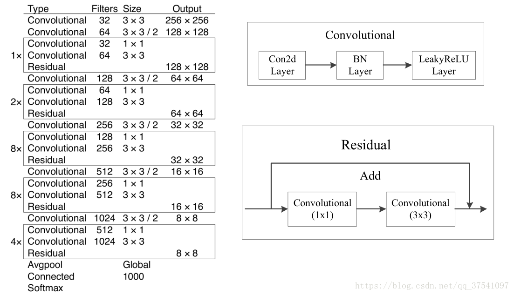

# Darknet53

## Info

This is a Pytorch implementation of Darknet53 network. It is used for feature extraction fo Yolov3.

The original paper can be found [this link.](https://pjreddie.com/media/files/papers/YOLOv3.pdf)

## Network Structure

Copyright: [https://blog.csdn.net/qq_37541097]

## Reference
>[ [1] YOLOv3: An Incremental Improvement ](https://pjreddie.com/media/files/papers/YOLOv3.pdf)

>[ [2] darknet framework ](https://github.com/pjreddie/darknet)

>[ [3] ImageNet training in PyTorch](https://github.com/pytorch/examples/tree/master/imagenet)
